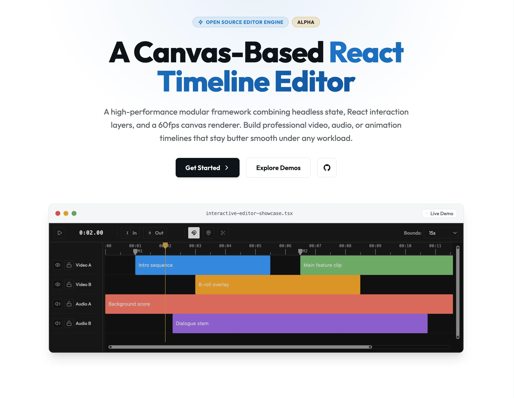

# Canvas Timeline

[](https://www.npmjs.com/package/@techsquidtv/canvas-timeline)
[](https://github.com/techsquidtv/canvas-timeline/blob/main/LICENSE)
[](https://github.com/techsquidtv/canvas-timeline/actions/workflows/ci.yml)
[](https://canvastimeline.com/docs)

Canvas Timeline is a canvas-based React timeline editor engine for video, audio,
and animation tools. It combines a headless timeline engine, React interaction
layers, and a worker-backed canvas renderer so dense editing surfaces can stay
smooth while your app owns the product UI around them.



## Start Here

- [Documentation](https://canvastimeline.com/docs)
- [Getting started](https://canvastimeline.com/docs/getting-started)
- [Live demos](https://canvastimeline.com/demos)
- [Package docs](https://canvastimeline.com/packages)
- [React registry](https://canvastimeline.com/packages/react/registry)
- [NPM package](https://www.npmjs.com/package/@techsquidtv/canvas-timeline)

## Install

```bash
pnpm add @techsquidtv/canvas-timeline
```

```tsx
import {
  CanvasRenderer,
  Timeline,
  TimelineEngine,
  TimelineProvider,
  fromSeconds,
} from '@techsquidtv/canvas-timeline';
import '@techsquidtv/canvas-timeline/styles.css';

const engine = new TimelineEngine({
  duration: fromSeconds(15),
  tracks: [],
});

export function EditorTimeline() {
  return (
    <TimelineProvider engine={engine}>
      <Timeline.Root>
        <CanvasRenderer />
        <Timeline.ClipInteractionLayer />
        <Timeline.PlayheadArea />
        <Timeline.PlayheadGrabber />
      </Timeline.Root>
    </TimelineProvider>
  );
}
```

## Status

Canvas Timeline is alpha software. The first planned public release is `0.0.1`.
Breaking changes are acceptable before the API reaches `0.1.0`, and this project
does not keep backwards-compatibility aliases or fallback APIs during that
period.

## Packages

Use `@techsquidtv/canvas-timeline` for the common React + canvas path, or install
focused packages when you need a lower-level layer:

- `@techsquidtv/canvas-timeline-core` - headless state, editing, playback, history, snapping, and markers.
- `@techsquidtv/canvas-timeline-react` - provider, hooks, and delegated interaction layers.
- `@techsquidtv/canvas-timeline-renderer` - canvas drawing, theme resolution, and worker-backed rendering.
- `@techsquidtv/canvas-timeline-utils` - rational time and shared timeline math.
- `@techsquidtv/canvas-timeline-html-media-adapter` - native HTML media element sync.
- `@techsquidtv/canvas-timeline-mediabunny-adapter` - optional Mediabunny-powered media integration.

## Repository

This monorepo contains the package source, local demos, and the Astro docs site
published at [canvastimeline.com](https://canvastimeline.com).

```bash
vp install
vp run dev
vp run dev:www
vp run repo:check
vp test
```

See [Contributing](./.github/CONTRIBUTING.md) for package boundaries,
validation, changesets, and release publishing.
